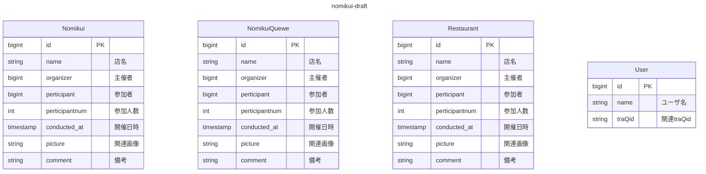

## draft:正規化とか考えずとりあえず欲しい情報書き出す

- nomikui
    - ID
    - 店
    - 主催者
    - 参加者
    - 参加人数
    - 開催日時
    - 関連画像
    - 備考

- nomikui予約/待機キュー
    - ID
    - 店
    - 主催者
    - 参加者
    - 希望人数
    - 開催日時
    - 締切日時
    - 備考

- 店データ
    - ID
    - 名前
    - 場所
    - タグ
    - ジャンル
    - 価格帯
    - 収容人数
    - レビュー
    - 関連画像

- ユーザに紐付くデータ
    - ID(traQUUID)
    - 過去のnomikui募集
    - 過去のnomikui参加
    - お気に入り店
    - nomikuiEXP

<!-- draft状態 -->

## first:第一正規化

