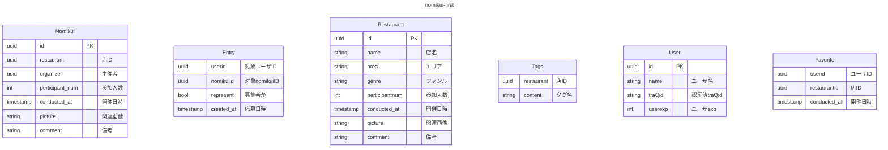
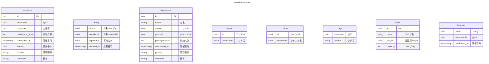

## draft:正規化とか考えずとりあえず欲しい情報書き出す

- nomikui
    - ID
    - 店
    - 主催者
    - 参加者
    - 希望人数
    - 開催日時
    - 締切日時
    - 備考

- 店データ
    - ID
    - 名前
    - 場所
    - タグ
    - ジャンル
    - 価格帯
    - 収容人数
    - レビュー
    - 関連画像

- ユーザに紐付くデータ
    - ID(traQUUID)
    - 過去のnomikui募集
    - 過去のnomikui参加
    - お気に入り店
    - nomikuiEXP

<!-- draft状態 -->


## first:第一正規化

- Nomikuiテーブルの参加者,Userテーブルの募集/参加関連を`Entry`テーブルで解決
- Restaurantテーブルの`[]string tags`を解決→別テーブルを作る
- Userテーブルの`[]uuid favorite`を解決→別テーブルを作る



## second:第二正規化

- エリア,ジャンル番号の実装



## third:第三正規化

<!-- ```mermaid
---
title:nomikui-second
---

``` -->
