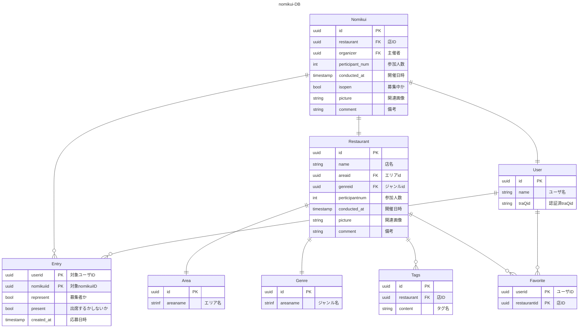

# nomikui-match
nomikuiのマッチングサービス

```mermaid
---
title: nomikui-DB
---
erDiagram

  Nomikui ||--o{ Entry : ""
  Nomikui ||--|| Restaurant : ""
  Nomikui ||--|| User : ""

  Restaurant ||--|| Area : ""
  Restaurant ||--|| Genre : ""
  Restaurant ||--o{ Tags : ""
  Restaurant ||--o{ Favorite :""

  User ||--o{ Favorite : ""
  User ||--o{ Entry : ""

  Nomikui {
    uuid id PK
    uuid restaurant FK "店ID"
    uuid organizer FK "主催者"
    int perticipant_num "参加人数"
    timestamp conducted_at "開催日時"
    bool isopen "募集中か"
    string picture "関連画像"
    string comment "備考"
  }

  Entry {
    uuid userid PK "対象ユーザID"
    uuid nomikuiid PK "対象nomikuiID"
    bool represent "募集者か"
    bool present "出席するかしないか"
    timestamp created_at "応募日時"
  }

  Restaurant {
    uuid id PK
    string name "店名"
    uuid areaid FK "エリアid"
    uuid genreid FK "ジャンルid"
    int perticipantnum "参加人数"
    timestamp conducted_at "開催日時"
    string picture "関連画像"
    string comment "備考"
  }

  User {
    uuid id PK
    string name "ユーザ名"
    string traQid "認証済traQid"
  }

  Area {
    uuid id PK
    strinf areaname "エリア名"
  }

  Genre {
    uuid id PK 
    strinf areaname "ジャンル名"
  }

  Tags {
    uuid id PK
    uuid restaurant FK "店ID"
    string content "タグ名"
  }

  Favorite {
    uuid userid PK "ユーザID"
    uuid restaurantid PK "店ID"
  }

```
